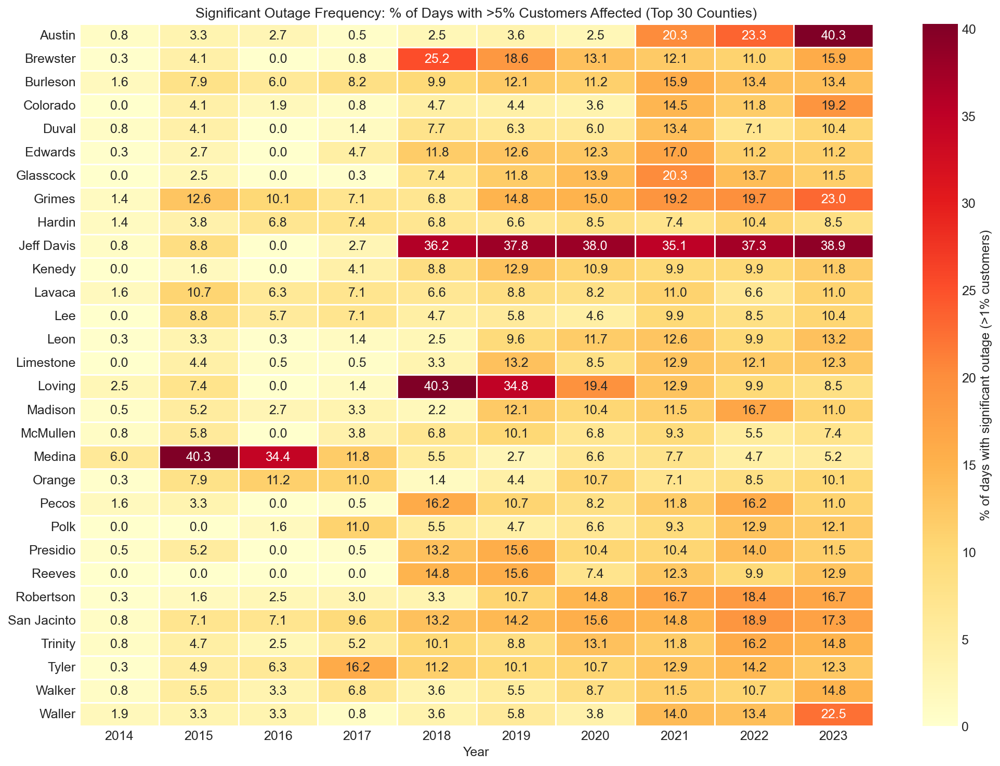
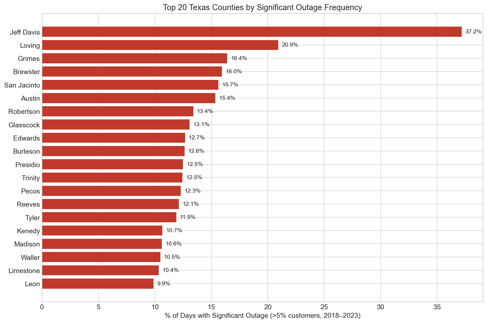
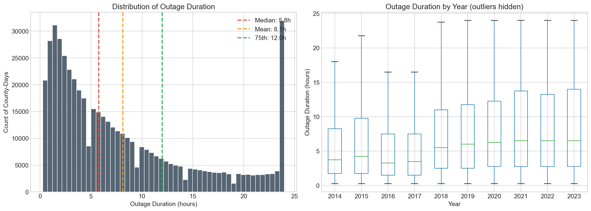
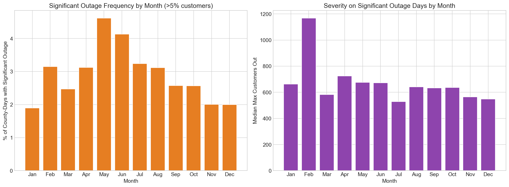

# BlackoutWatch

BlackoutWatch is a Texas-focused outage analytics project that transforms raw outage, weather, and storm-event sources into a county-day dataset for exploratory analysis and downstream machine learning.

This repository is now set up to be showcased in two ways:

- GitHub repo view: a cleaner README with visuals, findings, and pipeline context
- GitHub Pages view: a static showcase page in `docs/` for recruiter-friendly browsing

## Quick Links

- Showcase page: publish `docs/` with GitHub Pages, then use that URL on your resume or LinkedIn
- Static page source: `docs/index.html`
- Main outage dataset: `data/processed/eagle_i_texas_daily.csv`
- Notebook analysis: `notebooks/01_eda_eagle_i.ipynb`

## Project Snapshot

- Coverage: 254 Texas counties
- Time span: 2014-01-01 through 2023-12-31
- Dataset scale: 927,608 county-day outage records
- Largest single-county daily peak: 455,986 customers out
- Highest cumulative outage burden in this processed dataset: Dallas County

## Why This Project Is Worth Showing

- It combines multiple public data sources into a unified analytical dataset rather than analyzing a single CSV in isolation.
- It demonstrates end-to-end data engineering: acquisition, cleaning, geographic mapping, aggregation, enrichment, and export.
- It produces outputs that are immediately useful for forecasting, resilience analysis, and outage-risk modeling.
- It includes both code and visual artifacts, so a recruiter can understand the work quickly without running the full pipeline.

## Key Findings

- Outage burden is concentrated in major urban counties, with Dallas, Harris, Travis, Tarrant, and Bexar standing out by cumulative customer impact.
- June is the highest-outage month in the processed county-day series, with late spring and summer showing elevated disruption rates.
- The largest daily spikes occur during the February 2021 Texas winter crisis, especially in Harris, Dallas, and Tarrant counties.
- The final processed outputs align outage behavior with weather and storm signals, which makes the repository useful for later machine learning experiments.

## Visual Preview

### County-Year Heatmap



### Most Frequently Affected Counties



### Duration and Seasonal Behavior





## Showcase Page

The repository includes a recruiter-facing static page in `docs/`:

- `docs/index.html`
- `docs/site.css`

To publish it with GitHub Pages:

1. Push the latest repo state to GitHub.
2. Open `Settings` in the GitHub repository.
3. Go to `Pages`.
4. Choose `Deploy from a branch`.
5. Set the branch to `main` and the folder to `/docs`.
6. Save and use the generated Pages URL as your public project demo link.

## What The Pipeline Does

Run the scripts in this order:

```bash
python scripts/01_download_data.py
python scripts/02_preprocess_eagle_i.py
python scripts/03_scrape_station_data.py
python scripts/04_county_station_mapping.py
python scripts/05_preprocess_ghcn.py
python scripts/06_preprocess_storm_events.py
```

### Step Summary

1. `01_download_data.py`
   Downloads EAGLE-I outage files and supporting metadata from Figshare into `data/raw/eagle_i/`.
2. `02_preprocess_eagle_i.py`
   Filters outage records to Texas, aggregates 15-minute observations into daily county metrics, adds customer-count metadata, and writes `data/processed/eagle_i_texas_daily.csv`.
3. `03_scrape_station_data.py`
   Uses the FCC geography API to map Texas GHCN weather stations to counties.
4. `04_county_station_mapping.py`
   Builds a fallback nearest-centroid county mapping, compares it to the FCC mapping, and writes the final station-to-county map.
5. `05_preprocess_ghcn.py`
   Aggregates station weather observations into county-day weather features and writes `data/processed/ghcn_texas_daily.csv`.
6. `06_preprocess_storm_events.py`
   Aggregates NOAA storm event records into county-day indicators and writes `data/processed/storm_events_texas_daily.csv`.

## Repository Layout

```text
BlackOutWatch/
├── data/
│   ├── raw/              # External source files, ignored by git
│   └── processed/        # Derived county-day datasets tracked in this repo
├── docs/                 # Static showcase page for GitHub Pages
├── notebooks/            # EDA and scratch notebooks
├── reports/figures/      # Exported visual summaries
├── scripts/              # Data collection and preprocessing scripts
├── README.md
└── requirements.txt
```

## Setup

```bash
python -m venv .venv
source .venv/bin/activate
pip install -r requirements.txt
```

## Data Sources

- EAGLE-I (ORNL / DOE): county-level outage data at 15-minute intervals
- GHCN-Daily (NOAA): daily weather observations from Texas stations
- NOAA Storm Events: severe weather event records with county or forecast-zone references
- FCC Census Block API: station-to-county lookup by latitude and longitude

## Reproducibility Notes

- `data/raw/` is intentionally ignored because the original source files are large and externally hosted.
- `data/processed/` is included so the current outputs can be inspected without rerunning the full pipeline.
- A fresh clone is not fully reproducible until the raw source files are downloaded or placed in the expected `data/raw/` subfolders.
- Some steps depend on external APIs and may take time to run.

## Current Outputs

- `data/processed/eagle_i_texas_daily.csv`
- `data/processed/ghcn_texas_daily.csv`
- `data/processed/storm_events_texas_daily.csv`
- `data/processed/station_county_mapping_final.csv`

## Notes

- The tracked processed CSVs make the repository relatively large, but each individual file remains below GitHub's 100 MB hard limit.
- GitHub may still warn that some files are above its recommended 50 MB size threshold.
